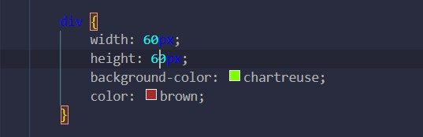
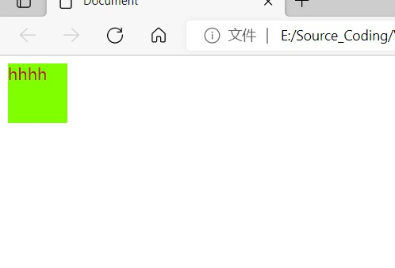
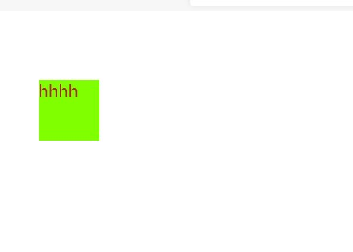
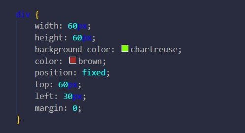
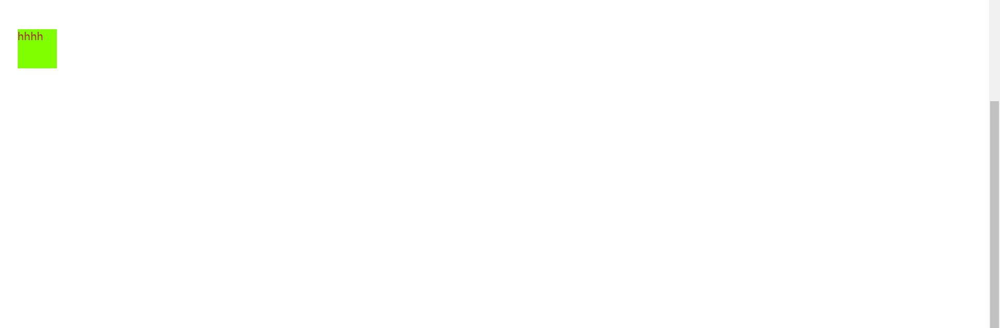

#定位

position,定位相对哪一片空间进行定位不由得发问？
没错，当然是显示器，更准确的说是视口（视觉入口），其坐标原点一般为左上位置。并且只有设置了position才能使用top,bottom,left,right,否则无法生效。
其属性值包括：
    static静态;
    relative相对;
    fixed固定;
    absolute绝对

默认为static,就是该怎么样就怎么样。
而relative，则是相对于static进行偏移

这是静态的渲染效果：

之所以会和边界有些距离是因为margin不为0；

然后呢，做一些调整：

渲染效果：

相对于原来位置偏移了，上方偏移了60px,左边30px.

修改为fixed:
    

    渲染效果变成了：
    

相对于整个视口固定了

当修改为absolute则是相对于父元素进行定位，请与relative进行一些区分。