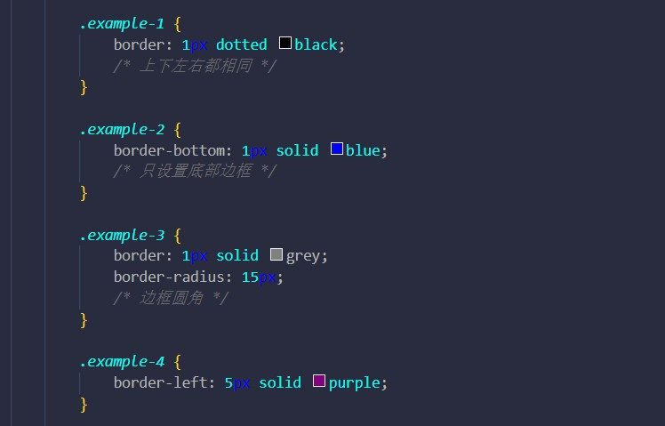
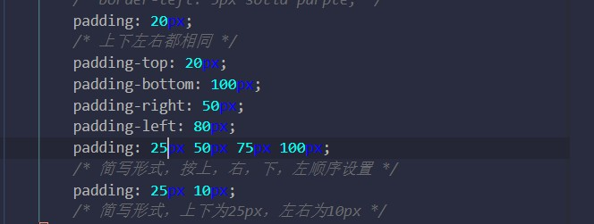

边框和边距相信大家都知道是什么，这里主要为大家介绍一下它们一些相关的属性以及默认参数的对应关系。

#边框

渲染效果：

根据渲染效果可以得到一下结论：
    1.border默认是上右下左四个方向；
    2.dotted代表虚线，solid代表实线；
    3.border-xxxxx中xxxx代表border的方位,或者样式，比如bottom就是底部，radius就是边框圆角；

#边框

对应渲染效果：

虽然不是很明显但依然看得到，明显间距变大了。其实和上面的边框差不多，主要是要注意简写形式。

