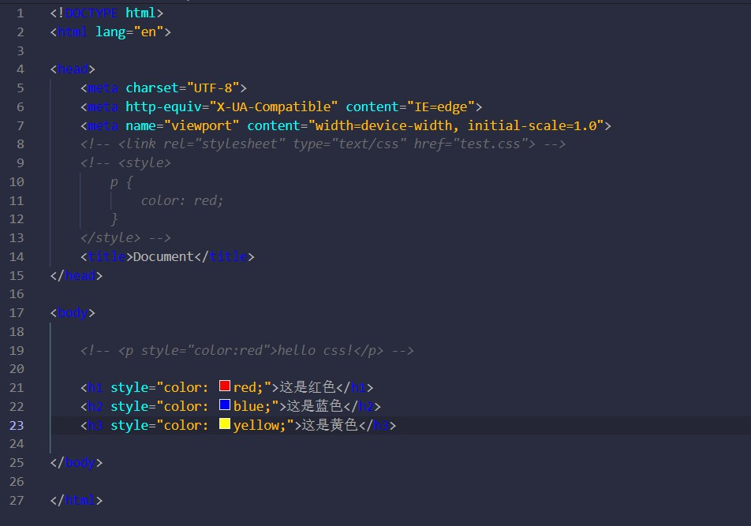
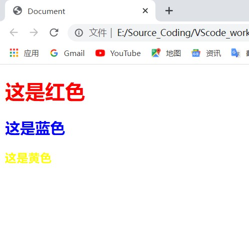
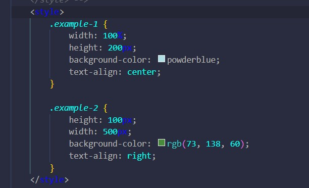
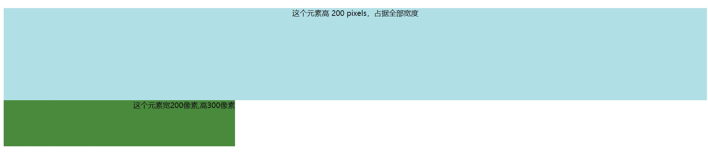

#颜色

    为了大家能更直观的感受到，代码和渲染效果之间的对应关系，下面我将使用内联标签，来为大家演示.

嗯没错，就是这么简单。

当然，如果你想更专业一点，那就可以用RGB值来确定色调，关于RGB在下就不过多赘述，自行百度。

#尺寸

    对应一般显示设备，其尺寸都由高（height)和宽(width)决定。而他们的值可以是百分比形式，也可以是像素，甚至可以是厘米。

对应渲染效果：

#对齐

    对应的属性名为：text-align,默认缺省值为左对齐。
    注意一定不要用内联，否者无效。

