#HTML元素

##元素是什么？

    比如：<head></head>,<body></body>, ;这些都是元素,也叫做标签；简单的理解就是打尖括号的都是元素，聪明的你一定发现了有的元素成对出现，有的则单独出现；所有我们一般将成对出现的叫双标签，单独出现的叫单标签。

##元素的简单介绍：

##标题标签##
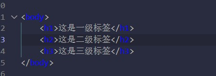
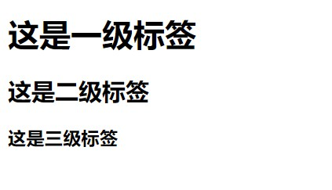

    <h1></h1>等就是标题标签，可以明显感受到更加醒目；

##超链接标签##
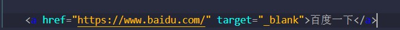
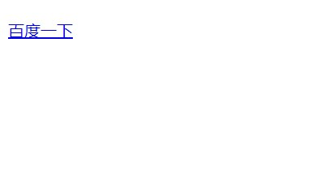

这就是超链接标签，以及它在浏览器下渲染的结果；
当点击蓝色的“百度一下”，它将跳转到指定页面：
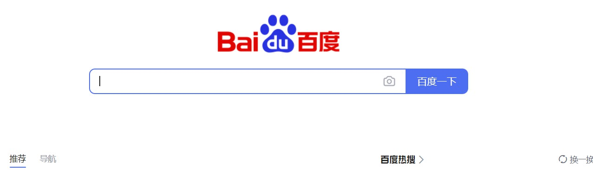

##图片标签##
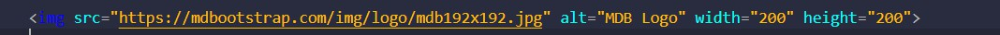
浏览器渲染结果，也就是将对应图片放到指定位置

##table标签##

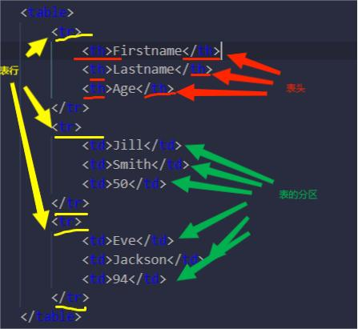

以下为浏览器渲染效果：
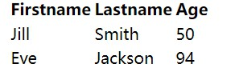

##list标签##
    list标签分为两种：无序标签和有序标签。

    ###无序标签

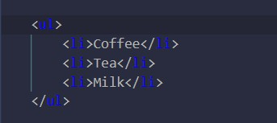

    ###对应渲染效果
    
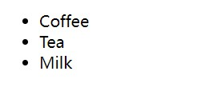

    ##有序标签
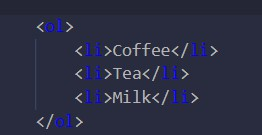

    ##对应渲染效果
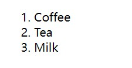

可以发现每行，行首由无序的小圆点变成了阿拉伯数字进行了简单的排序;

