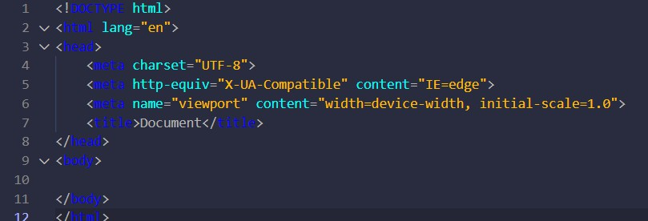

#HTML笔记

hello world!

##HTML是什么？
    html中文翻译为“超文本标记语言”，英文全称“HyperText Markup Language”，是用于创建网页，运行在浏览器上，由浏览器渲染出结果，最终呈现给用户。

##HTML文件内容的一般形式：
    

    第一行标明本文件类型是html;
    余下部分,<html>...</html>则为html文件内容;
    其由<head>...</head>和<body>...</body>两部分构成;
    <head> 元素包含了文档的元（meta）数据,就是说明一些编码格式，以及一些样式，一般与内容无关;
    <body> 元素包含了文档的内容;

##元素<head>包含元素：

        <meta charset="UTF-8">//元数据，其字符集为“UTF-8”,也就万国码

        <meta http-equiv="X-UA-Compatible" content="IE=edge">//X-UA-Compatible是IE8的一个专有<meta>属性，它告诉IE8采用何种IE版本去渲染网页，在html的<head>标签中使用。

        <meta name="viewport" content="width=device-width, initial-scale=1.0">//可通过百度了解，我就不赘述了

        <title>Document</title>//设置标题为Document
##如图：
    

##元素<body>包含元素：

    内容较多下一章将详细讨论。

##第一次