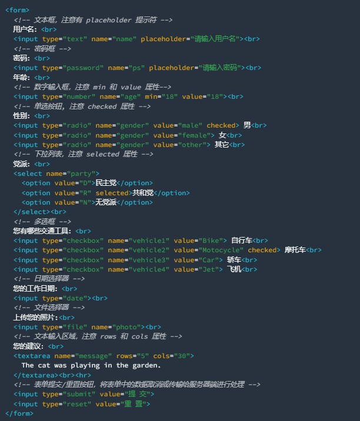
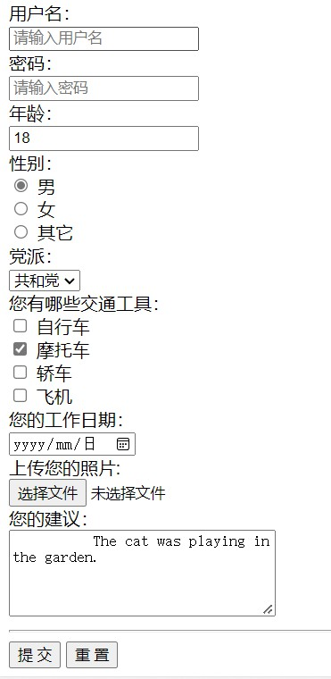

#表单标签以及其他标签

##首先什么是表单？

    浏览器渲染的效果：

也就是平时注册和登录界面没有美化的样子，相信这么一说大家也就瞬间明白了，那代码是怎样一步一步实现它的呢？

##代码分析

比如：

type,name,placehoder都是元素的属性，而引号部分就是它们的的值（value）。

type属性表示标签的种类，包括“text”，“password”，“radio”等;

name属性主要在单选框时有用，用来分组；

placehoder属性就是显示一些提示符；

##其他标签

###区块标签

    区块元素在浏览器显示时，通常会以新行来开始（和结束）。如：<h1>, <pre>, <ul>, <table>，
 等。
    简单理解就是：一个标签占一行。

###内联标签（也叫做行内标签）

    内联元素相反，他们总是一个接一个进行显示，不会新起一行。如： , <input>, <td>, <a>, 等。
    简单理解就是：一行占多个标签，直到占满才换行。

###预设格式

    <pro></pro>也就是保存标签原有的格式，不必向其他标签由于编译优化等原因而改变原有格式。

###特殊字符

    就如同c语言中关键字冲突，所以用一些转义字符来显示关键字。
    特殊字符可参考ISO-8859-1 字符实体手册

    