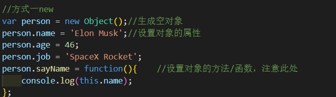
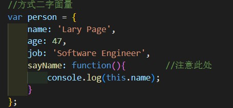
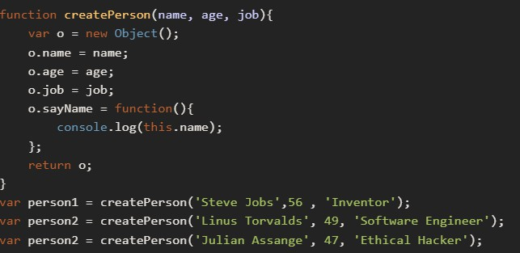

和函数一样，相信大家都很熟，但在javascript这类解释型语言中，它的定义有一些不一样，反正记住解释型语言--“万物皆对象”；

# 创建对象的方法有两种：
第一种：创建空对象，然后给他赋值。

第二种：创建对象的同时给它的属性赋值。

可以看出这两种，写法代码复用率低，所以嘛，一般不用这种写法。

第三种：为解决这个问题，人们开始使用工厂模式的一种变体。

简单介绍一下，什么叫工厂模式
工厂方法模式的实质是"定义一个创建对象的接口，但让实现这个接口的类来决定实例化哪个类。工厂方法让类的实例化推迟到子类中进行。"

还有其他22种模式，具体的可以到网上搜。