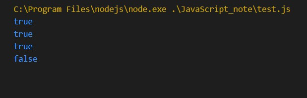
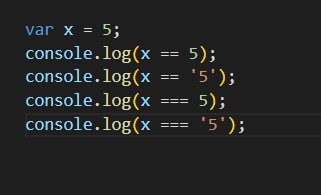

# 一元操作符 ++ --

和C语言一样

# 布尔操作符 && || ！

注意：1.双与和双非 都是短路操作
    2.除下列值外都是真值：false null undefined "" 0 nan

# 算术操作符 + - * / %
和C语言一样
额外的：
"+":和Java很像，可以加字符串，有字符串的话数字也当字符串加，没有字符串，只有数字时才会进行数学运算。

# 关系操作符 <> <=>= == === != !==
主要是“===”,讲一下。

"=="和“===”的区别在于前面的不准，后面的准，不然怎么叫恒等；所有比较时，更推荐用“===”。

# 条件（问号）操作符 ? :
和C语言一样
三目运算符 

# 赋值操作符 = += -+ *= /= %=

和C语言一样