ECMAScript 中的数组与其他多数语言中的数组有着相当大的区别。虽然 ECMAScript 数组与其他语言中的数组都是数据的有序列表，但与其他语言不同的是，ECMAScript 数组的每一项 可以保存任何类型的数据（不建议！）。
我的理解是javascript中数组的每个元素储存的都是一个对象，而非一个具体的类型。
其次，Javascript 中的数组个数理论上，没有上限。

# 创建数组

1.创建数组对象
2.字面量：在计算机科学中，字面量（literal）是用于表达源代码中一个固定值的表示法（notation）。
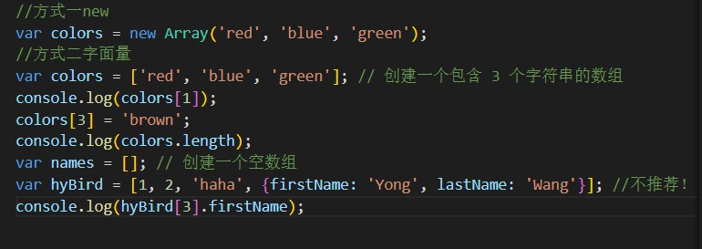

# 常用的数组方法

1.元素联合

就是将元素全部打印，并用分隔符分割。

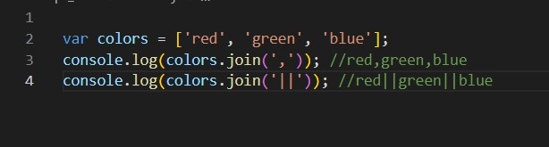

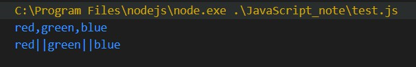

2.堆栈方法

栈，先进后出的一种数据结构。

这个堆栈方法指的是，push,压栈压到数组的尾部，pop则是弹出尾部。

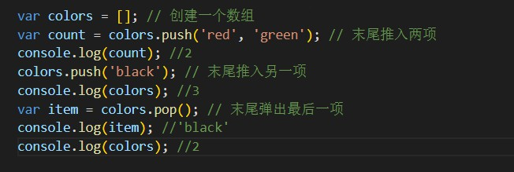
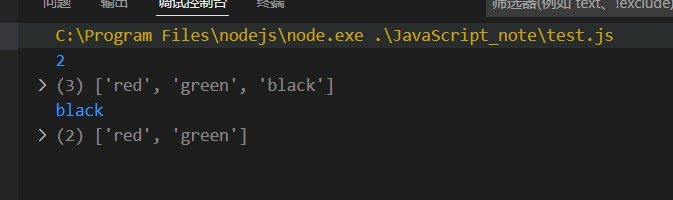

3.队列方法

队列，一种先进先出的数据结构。

队列在列表的末端添加项，从列表的前端移除项。

由于 push() 是向数组末端添加项的方法，因此要模拟队列只需一个从数组前端取得项的方法。实现这一操作的数组方法就是 shift() ，它能够移除数组中的第一个项并返回该项，同时将数组长度减1。

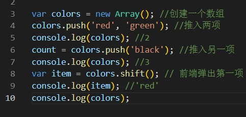

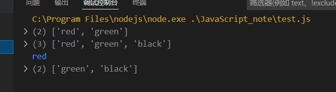

ECMAScript 还为数组提供了一个 unshift() 方法。它能在数组前端添加任意个项并返回新数组的长度。

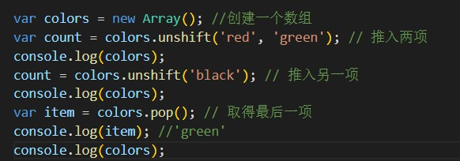

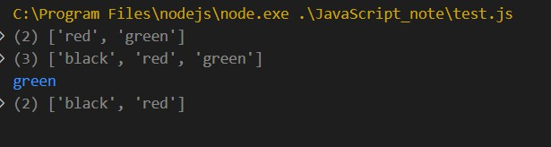

总结：由上可知， push、pop操作在数组末，而 unshift、shift操作在数组头；push、unshift压入而pop、shift弹出。

4.反转数组项

就是对数组调用reverse函数

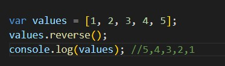

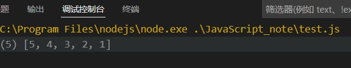

5.链接方法

可能叫连接，更好一点。形式上来说，就是一个数组对象调用concat函数，将其连接到原的后面，当然最后返回的是一个新数组，原数组没有改变，和字符串相加有点像。

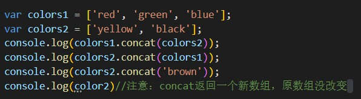

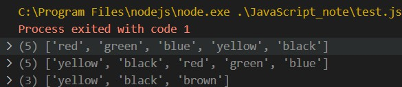

6.切片方法

slice() ，它能够基于当前数组中的一或多个项创建一个新数组。 slice() 方法可以接受一或两个参数，即要返回项的起始和结束位置。

在只有一个参数的情况下， slice() 方法返回从该参数指定位置开始到当前数组末尾的所有项。如果有两个参数，该方法返回起始和结束位置之间的项——但不包括结束位置的项。

基本上，就是要注意一下，两个参数时，左闭右开。
还有就是，参数不是指的下标，而是第几个。
以及，第一个参数是位置，第二个参数是新数组的个数。
最后，slice方法不影响原数组。

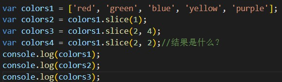

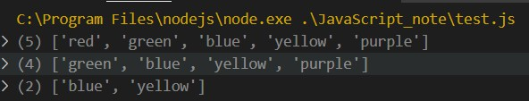

7.splice方法

splice 方法是对原始数组进行修改

删除：可以删除任意数量的项，只需指定 2 个参数：要删除的第一项的位置和要删除的项数。 例如， splice(0,2) 会删除数组中的前两项。

插入：可以向指定位置插入任意数量的项，只需提供 3 个参数：起始位置、0（要删除的项数） 和要插入的项。如果要插入多个项，可以再传入第四、第五，以至任意多个项。例如， splice(2,0,'red','green') 会从当前数组的位置 2 开始插入字符串 'red' 和 'green' 。

替换：可以向指定位置插入任意数量的项，且同时删除任意数量的项，只需指定 3 个参数：起 始位置、要删除的项数和要插入的任意数量的项。插入的项数不必与删除的项数相等。例如， splice (2,1,'red','green') 会删除当前数组位置 2 的项，然后再从位置 2 开始插入字符串 'red' 和 'green' 。

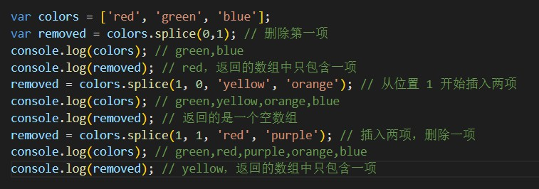

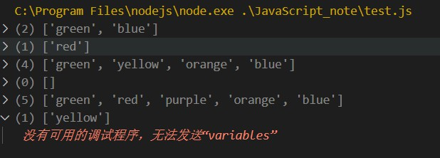